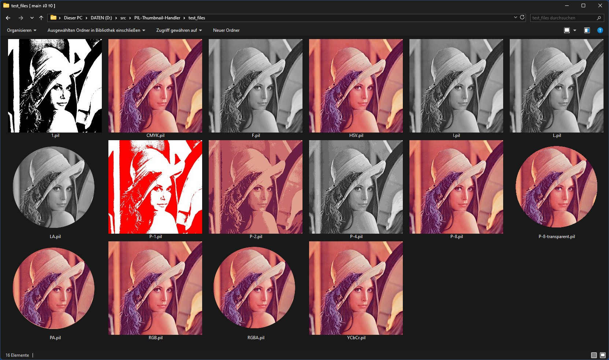

# Pillow-Plugins - 8 plugins for Pillow (Python)

## 1. [DcrawImagePlugin](/DcrawImagePlugin)

Read support for many (most?) camera RAW file formats based on dcraw.

Requires [dcraw](http://www.dechifro.org/dcraw/) (binary for Windows is included, in Debian-based Linux distros install it with `sudo apt install dcraw`).

Usage:
```python
from PIL import Image
import DcrawImagePlugin

img = Image.open("test.nef")
img.show()
```

## 2. [FfmpegImagePlugin](/FfmpegImagePlugin.py)
Allows [Pillow](https://pillow.readthedocs.io/) to load arbitrary video files as (virtual) multi-frame images.  
Requires [FFmpeg](https://ffmpeg.org/).

Usage:
```python
from PIL import Image
import FfmpegImagePlugin

img = Image.open("test.mp4")
img.seek(123)  # load frame 124 (seek starts counting with 0)
img.show()
```

## 3. [FreeImagePlugin](/FreeImagePlugin)
Read support for additional image file formats/image modes based on FreeImage.
- MNG (first frame, i.e. not animated)
- Apple PICT
- PSD/TIFF with 16 and 32 bits (floating point) per channel.  

Requires [FreeImage](https://freeimage.sourceforge.io/) (DLL for Windows is included, in Debian-based Linux distros install it with `sudo apt install libfreeimage3`).

Usage:
```python
from PIL import Image
import FreeImagePlugin

img = Image.open("test.pct")
img.show()
```

## 4. [GhostImagePlugin](/GhostImagePlugin)
Allows Pillow to load PDF and Adobe Illustrator (AI) files as (virtual) multi-frame images.  
Requires [Ghostscript](https://ghostscript.com/) (binary for Windows is included, in Debian-based Linux distros install it with `sudo apt install ghostscript`).

Usage:
```python
from PIL import Image
import GhostImagePlugin

img = Image.open("test.pdf")
img.seek(2)  # load page 3 (seek starts counting with 0)
img.show()
```

## 5. [LibreImagePlugin](/LibreImagePlugin.py)
Allows Pillow to load CorelDraw (CDR), Macromedia FreeHand (FH/FHx) and OpenDocument Graphic (ODG) files as images via headless LibreOffice Draw.  
Requires [LibreOffice Draw](https://www.libreoffice.org/) (or OpenOffice Draw, not tested).

Usage:
```python
from PIL import Image
import LibreImagePlugin

img = Image.open("test.cdr")
img.show()
```

## 6. [SvgImagePlugin](/SvgImagePlugin)
Allows Pillow to load SVG vector graphic files as images.  
Depends on [pycairo](https://pycairo.readthedocs.io/) (`pip install pycairo`, also available for Windows).

Usage:
```python
from PIL import Image
import SvgImagePlugin

img = Image.open("test.svg", output_width = 800)
img.show()
```
## 7. [PilImagePlugin](/PilImagePlugin.py)
Simple image plugin that allows Pillow to read and write image files with a custom image file format called "PIL" (.pil). 

The PIL image file format supports *any* image mode that Pillow supports - that's the idea of the format and the reason why I invented it. So it can be used to save and load images also with rather exotic modes like e.g. "PA" (palette + alpha channel) or "LA" (grayscale + alpha channel), or 1-bit images with 2 custom colors instead of b/w (rawmode "P:1").

The format supports DEFLATE compression of the image data, which is the same compression that PNG uses. Therefor a compressed RGB PIL file has roughly the same filesize as the same image stored as PNG.

Usage:
```python
from PIL import Image
import PilImagePlugin

img = Image.open("test.pil")
img.show()
```

There is also a [Thumbnail Handler Shell Extension](https://github.com/59de44955ebd/PIL-Thumbnail-Handler) for Windows that allows Windows Explorer to show thumbnails for PIL files (15 modes supported).

*Windows 11 Explorer showing thumbnails for PIL files with various image modes*     


## 8. [WinImageShowPlugin](/WinImageShowPlugin.py)
A better and way faster Image.show() implementation for Python 3.x x64 in Windows 10/11.

Images are shown in a native resizable viewer window, without creating
any temporary files.  
While the window is displayed, other (Pillow compatible) image files
can be dropped into it from Explorer to view them.  
In addition to Pillow the plugin only uses ctypes and the Windows API,
no 3rd-party modules involved.

Usage:
```python
from PIL import Image
import WinImageShowPlugin  # import overwrites Image.show() method

img = Image.open("test.tif")
img.show()  # Blocks code execution until viewer window is closed
```
The result in Windows 11   

